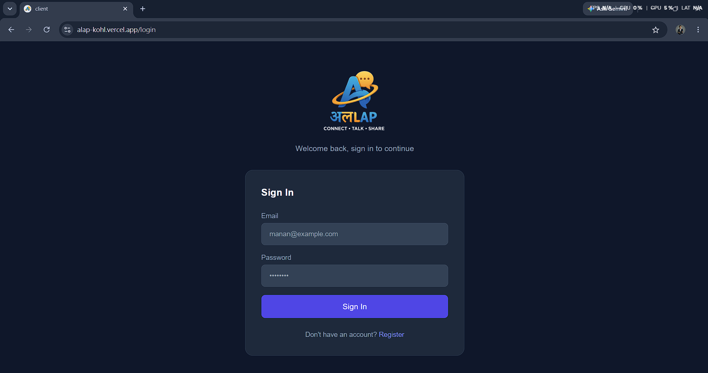
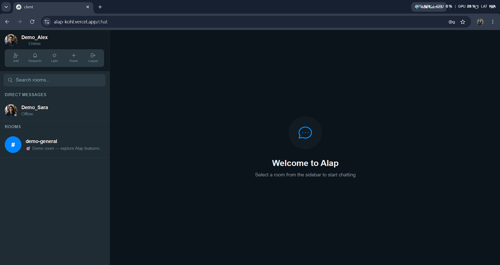
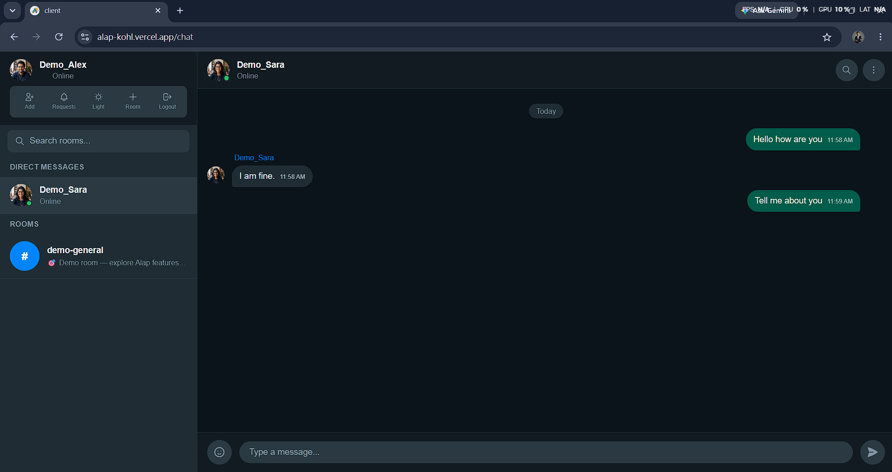
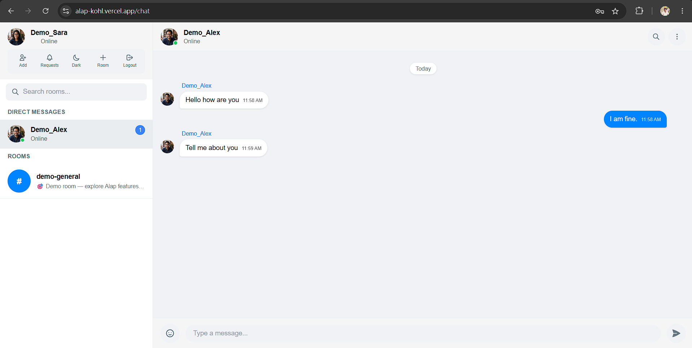
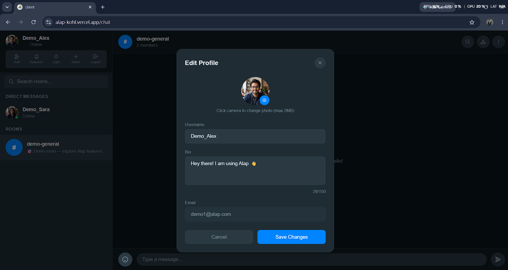
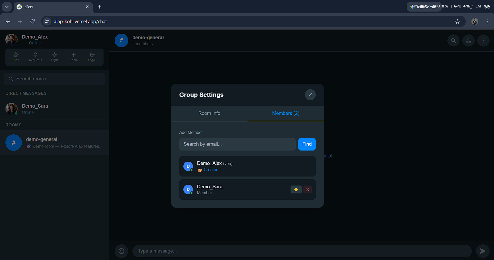
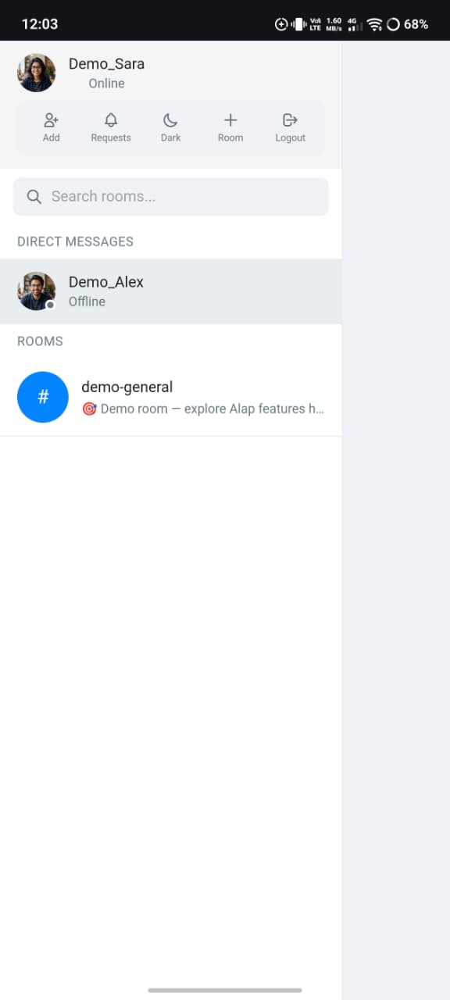
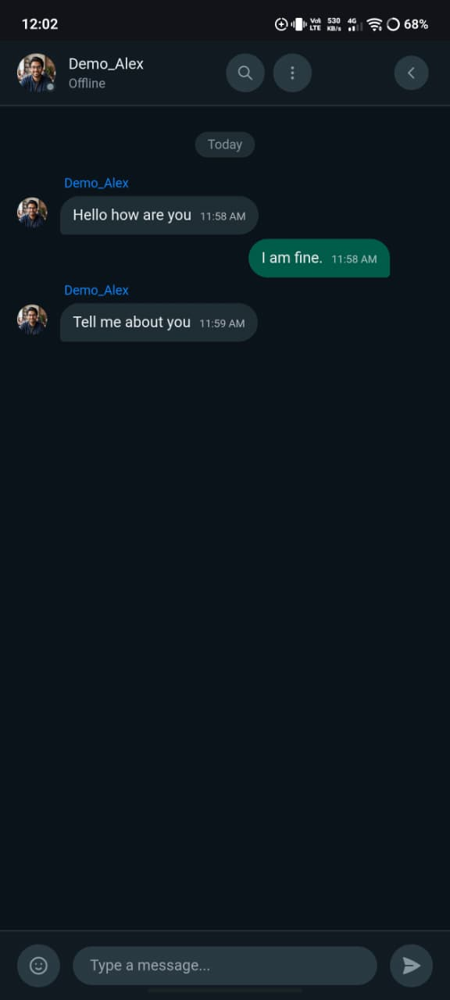

<div align="center">


# अलLAP — Real-Time Chat Application

### Connect • Talk • Share

[](https://alap-kohl.vercel.app)
[](https://alap-server.onrender.com/api/health)
[](https://github.com/manan-js-dev/Alap)
[](https://www.linkedin.com/in/manan-patel-dev/)

**A full-stack, production-ready real-time chat application built with modern web technologies.**
*Featuring one-to-one messaging, group chat, real-time notifications, and a beautiful WhatsApp-inspired UI.*

</div>

---

## 🎯 Try It Live — Demo Credentials

> No sign-up needed! Use these accounts to explore all features instantly.

| Account | Email | Password | Role |
|---------|-------|----------|------|
| 👨 Demo Alex | `demo1@alap.com` | `demo123456` | Male User |
| 👩 Demo Sara | `demo2@alap.com` | `demo123456` | Female User |

**🔗 [Open Live App →](https://alap-kohl.vercel.app)**
> Login with both accounts in separate browser windows (use Incognito for the second) to experience real-time messaging!

---

## 📸 Screenshots

<table>
  <tr>
    <td align="center" width="50%">
      
      <br/><b>Login Page</b>
    </td>
    <td align="center" width="50%">
      
      <br/><b>Chat Dashboard — Dark Mode</b>
    </td>
  </tr>
  <tr>
    <td align="center" width="50%">
      
      <br/><b>Real-Time Chat Window</b>
    </td>
    <td align="center" width="50%">
      
      <br/><b>Light Mode</b>
    </td>
  </tr>
  <tr>
    <td align="center" width="50%">
      
      <br/><b>Edit Profile with Avatar Upload</b>
    </td>
    <td align="center" width="50%">
      
      <br/><b>Group Settings — Member Management</b>
    </td>
  </tr>
  <tr>
    <td align="center" width="50%">
      
      <br/><b>Mobile — Light Mode</b>
    </td>
    <td align="center" width="50%">
      
      <br/><b>Mobile — Dark Mode</b>
    </td>
  </tr>
</table>

---

## ✨ Features

### 💬 Messaging
- **Real-time messaging** powered by Firebase Realtime Database
- **One-to-one DMs** — send connection requests by email, chat privately on acceptance
- **Group chat rooms** — create, join, and manage group conversations
- **Typing indicators** — see when someone is typing in real time
- **Message history** — persistent chat history across sessions
- **Emoji picker** — rich emoji support with dark/light theme
- **Date dividers** — messages grouped by date (Today, Yesterday, etc.)

### 🔔 Notifications
- **Browser push notifications** — get notified even when the tab is minimized
- **Unread message badges** — see unread count on each room/DM in sidebar
- **Real-time request notifications** — instant bell badge when someone sends a connection request
- **Notification persistence** — unread counts survive page reloads via localStorage

### 👥 User Management
- **JWT Authentication** — secure register/login with token-based auth
- **Edit profile** — update username, bio, and profile picture
- **Avatar upload** — powered by Cloudinary CDN
- **Online presence** — real-time online/offline status indicators
- **Search users** — find people by email address

### 🏠 Room Management
- **Create rooms** — set name and description
- **Group settings** — edit room info, add/remove members, promote to admin
- **Admin roles** — room creator gets admin privileges
- **Leave/Delete room** — with confirmation dialogs
- **Clear chat** — wipe all messages from a room

### 🎨 UI/UX
- **WhatsApp-inspired design** — clean, familiar chat interface
- **Dark & Light mode** — toggle with persistent preference
- **Fully responsive** — seamless experience on mobile and desktop
- **Mobile-first navigation** — sidebar/chat toggle on small screens
- **Smooth animations** — polished micro-interactions throughout

---

## 🛠️ Tech Stack

### Frontend
| Technology | Purpose |
|-----------|---------|
| React 19 + TypeScript | UI framework with full type safety |
| Vite 8 | Lightning-fast build tool |
| Tailwind CSS v3 | Utility-first styling |
| Socket.io Client | Real-time typing indicators & presence |
| Firebase RTDB | Real-time message delivery & persistence |
| Cloudinary | Avatar image upload & CDN |
| React Router v7 | Client-side routing |
| Zustand | Lightweight state management |
| Axios | HTTP client with interceptors |
| emoji-picker-react | Emoji picker component |

### Backend
| Technology | Purpose |
|-----------|---------|
| Node.js + Express | REST API server |
| TypeScript | Full type safety |
| MongoDB + Mongoose | Users, rooms, chat requests |
| Socket.io | Real-time events & notifications |
| JWT + bcryptjs | Authentication & password hashing |
| Zod | Input validation schemas |
| Firebase Admin | Message notifications |

### DevOps & Infrastructure
| Technology | Purpose |
|-----------|---------|
| GitHub Actions | CI/CD pipeline (tests + build on every push) |
| Jest + Supertest | 22 unit & integration tests, 85% coverage |
| Vercel | Frontend deployment |
| Render | Backend deployment |
| MongoDB Atlas | Cloud database |
| Firebase | Realtime Database |
| node-cron | Scheduled jobs (keep-alive + data cleanup) |

---

## 🏗️ Architecture

```
┌─────────────────────────────────────────────────────────┐
│                    CLIENT (Vercel)                       │
│   React + TypeScript + Vite + Tailwind CSS              │
└──────────────┬──────────────────────────────────────────┘
               │ REST API + Socket.io
               ▼
┌─────────────────────────────────────────────────────────┐
│                   SERVER (Render)                        │
│   Node.js + Express + TypeScript + Socket.io            │
└──────┬────────────────────────┬────────────────────────-┘
       │                        │
       ▼                        ▼
┌─────────────┐        ┌────────────────┐
│  MongoDB    │        │    Firebase     │
│  Atlas      │        │  Realtime DB   │
│             │        │                │
│ • Users     │        │ • Messages     │
│ • Rooms     │        │ • Real-time    │
│ • Requests  │        │   delivery     │
└─────────────┘        └────────────────┘
```

### Why Two Databases?
- **MongoDB** stores structured data — users, rooms, chat requests, metadata
- **Firebase RTDB** handles real-time message delivery — ultra-low latency, offline support
- **Socket.io** handles ephemeral events — typing indicators, online presence, notifications

---

## 🔌 API Reference

### Auth
| Method | Endpoint | Description |
|--------|----------|-------------|
| `POST` | `/api/auth/register` | Register new user |
| `POST` | `/api/auth/login` | Login & get JWT |
| `GET` | `/api/auth/me` | Get current user |

### Rooms
| Method | Endpoint | Description |
|--------|----------|-------------|
| `GET` | `/api/rooms` | Get all rooms |
| `POST` | `/api/rooms` | Create room |
| `PUT` | `/api/rooms/:id` | Edit room (admin) |
| `DELETE` | `/api/rooms/:id` | Delete room (admin) |
| `POST` | `/api/rooms/:id/members` | Add member (admin) |
| `DELETE` | `/api/rooms/:id/members/:userId` | Remove member (admin) |

### Chat Requests (DMs)
| Method | Endpoint | Description |
|--------|----------|-------------|
| `POST` | `/api/requests` | Send connection request |
| `GET` | `/api/requests` | Get pending requests |
| `PUT` | `/api/requests/:id` | Accept / Reject |
| `GET` | `/api/requests/direct-rooms` | Get DM conversations |

### Socket Events
| Event | Direction | Description |
|-------|-----------|-------------|
| `join_room` | Client → Server | Join a chat room |
| `typing` | Client → Server | Typing indicator |
| `notify_message` | Client → Server | Notify members of new message |
| `new_message_notification` | Server → Client | Unread message alert |
| `user_typing` | Server → Client | Someone is typing |
| `user_status` | Server → Client | Online / Offline update |
| `new_request` | Server → Client | New connection request |
| `request_accepted` | Server → Client | DM request accepted |
| `kicked_from_room` | Server → Client | Removed from room |

---

## 🚀 Getting Started Locally

### Prerequisites
- Node.js v20+
- MongoDB Atlas account (free)
- Firebase project (free)
- Cloudinary account (free)

### Clone & Install

```bash
# Clone the repository
git clone https://github.com/manan-js-dev/Alap.git
cd Alap

# Install server dependencies
cd server && npm install

# Install client dependencies
cd ../client && npm install
```

### Environment Setup

**Server** — create `server/.env`:
```env
PORT=5000
MONGODB_URI=mongodb+srv://your_uri_here
JWT_SECRET=your_jwt_secret
JWT_EXPIRES_IN=7d
CLIENT_URL=http://localhost:5173
```

**Client** — create `client/.env`:
```env
VITE_API_URL=http://localhost:5000/api
VITE_SOCKET_URL=http://localhost:5000
VITE_FIREBASE_API_KEY=your_key
VITE_FIREBASE_AUTH_DOMAIN=your_domain
VITE_FIREBASE_DATABASE_URL=your_db_url
VITE_FIREBASE_PROJECT_ID=your_project_id
VITE_FIREBASE_STORAGE_BUCKET=your_bucket
VITE_FIREBASE_MESSAGING_SENDER_ID=your_sender_id
VITE_FIREBASE_APP_ID=your_app_id
VITE_CLOUDINARY_CLOUD_NAME=your_cloud_name
VITE_CLOUDINARY_UPLOAD_PRESET=your_preset
```

### Seed Demo Data

```bash
cd server
npm run seed
```

### Run Development Servers

```bash
# Terminal 1 — Backend
cd server && npm run dev

# Terminal 2 — Frontend
cd client && npm run dev
```

Open [http://localhost:5173](http://localhost:5173) 🎉

### Run Tests

```bash
cd server && npm test
```

---

## 🔄 CI/CD Pipeline

Every push to `main` triggers GitHub Actions:

```
Push to main
    ↓
┌─────────────────────┐    ┌─────────────────────┐
│    Server CI        │    │    Client CI         │
│                     │    │                      │
│ ✅ TypeScript check │    │ ✅ TypeScript check  │
│ ✅ Jest tests (22)  │    │ ✅ Vite build        │
│ ✅ 85% coverage     │    │                      │
└─────────────────────┘    └─────────────────────┘
    ↓ Pass
Auto-deploy to Render + Vercel
```

---

## ⏰ Cron Jobs

Two scheduled jobs run automatically on the server:

### 💓 Keep-Alive Ping (Every 14 minutes)
Render's free tier sleeps after 15 minutes of inactivity — causing a ~50 second cold start on the next request. This job pings `/api/health` every 14 minutes to keep the server warm.

```
Every 14 minutes → GET /api/health → Server stays awake ✅
```

### 🧹 Data Cleanup + Reseed (Every 12 hours)
Since this is a demo app, all user-generated data is wiped every 12 hours to keep the database clean. Demo accounts and their data are preserved.

```
Every 12 hours (00:00 & 12:00 UTC):
  1. Delete all non-demo users
  2. Delete all non-demo rooms
  3. Delete all non-demo chat requests
  4. Delete all messages (MongoDB + Firebase)
  5. Re-seed demo users (Demo_Alex & Demo_Sara)
  6. Re-create demo room & DM
  7. Add welcome messages to Firebase
```

> **Demo data is always safe** — Demo_Alex and Demo_Sara accounts are never deleted.

---

## 📁 Project Structure

```
Alap/
├── .github/workflows/ci.yml   ← GitHub Actions CI/CD
├── server/                     ← Node.js Backend
│   ├── src/
│   │   ├── controllers/        ← Route handlers
│   │   ├── models/             ← Mongoose schemas
│   │   ├── routes/             ← Express routes
│   │   ├── middleware/         ← Auth & validation
│   │   ├── utils/              ← Socket.io, validators, seeder
│   │   └── __tests__/          ← Jest test suites
│   └── package.json
│
└── client/                     ← React Frontend
    ├── src/
    │   ├── components/
    │   │   ├── Chat/           ← Sidebar, ChatWindow, MessageList, etc.
    │   │   └── UI/             ← Reusable Avatar component
    │   ├── context/            ← Auth, Socket, Theme contexts
    │   ├── hooks/              ← useFirebaseMessages, useSocket
    │   ├── pages/              ← Login, Register, Chat pages
    │   └── utils/              ← API, Firebase, Cloudinary, Error helpers
    └── package.json
```

---

## 👨‍💻 Author

<div align="center">

**Manan Patel**
*JavaScript Developer | Full-Stack Web Developer*
*Node.js · React.js · TypeScript*

[](https://www.linkedin.com/in/manan-patel-dev/)
[](https://github.com/manan-js-dev)
[](mailto:manan.js.dev@gmail.com)

</div>

---

## 📄 License

MIT License — feel free to use this project as inspiration or reference.

---

<div align="center">

**⭐ If you found this project impressive, please give it a star!**

*Built with ❤️ by Manan Patel*

</div>
